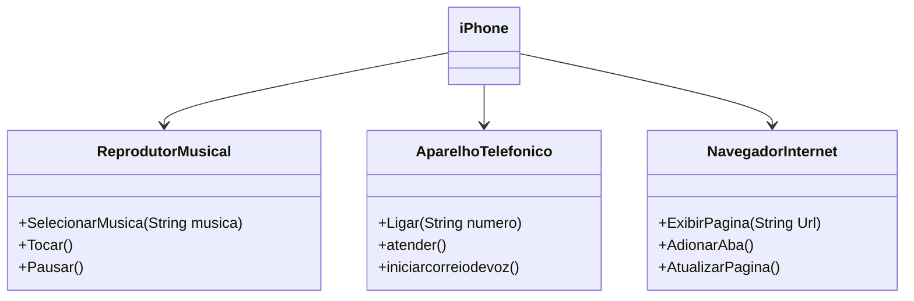

```mermaid
classDiagram
    class ReprodutorMusical {
        +SelecionarMusica(String musica)
        +Tocar()
        +Pausar()
    }

    class AparelhoTelefonico {
        +Ligar(String numero)
        +atender()
        +iniciarcorreiodevoz()
    }

    class NavegadorInternet {
        +ExibirPagina(String Url)
        +AdionarAba()
        +AtualizarPagina()
    }

    class iPhone {
    }

    iPhone --> ReprodutorMusical
    iPhone --> AparelhoTelefonico
    iPhone --> NavegadorInternet
```
